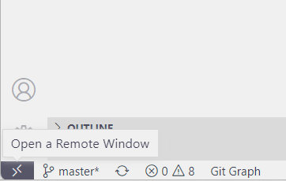
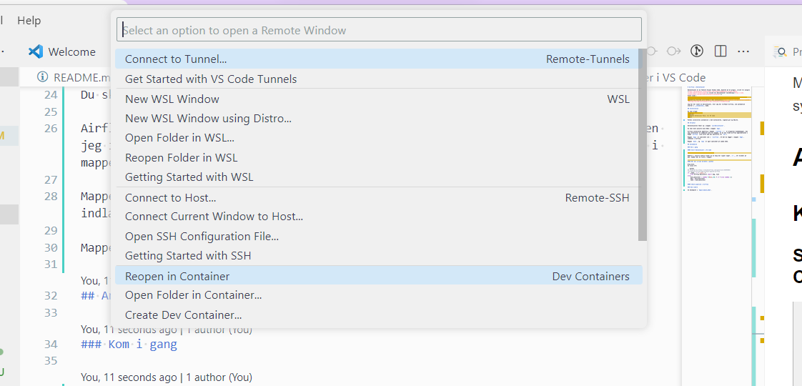

# Airflow i DevContainer

DevContainer er en feature Visual Studio Code, baseret på et plugin. [[link til plugin](https://marketplace.visualstudio.com/items?itemName=ms-vscode-remote.vscode-remote-extensionpack)] [[link til devcontainer vejledning](https://code.visualstudio.com/docs/devcontainers/containers)]
Flere links :
 - [How to create a Devcontainer for your Python project](https://godatadriven.com/blog/how-to-create-a-devcontainer-for-your-python-project-%F0%9F%90%B3/)
 - [Getting Started with Python 3 Dev Containers](https://medium.com/@dexterwilliams04/getting-started-with-python-3-dev-containers-4f14821fec6b)
  
Jeg har her lavet en devcontainer, hvor jeg har tilføjet Airflow, som automatisk starter i _standalone_ mode.

## Installation

Du skal bruge:
 - Visual Studio Code
 - Docker
 - Remote Extensions Pack, til VS Code
 - Git

Python installeres automatisk i dev-containeren, ligesom git og SQLite.

## Struktur

DevContaineren åbner op i mappen `/workspaces/airflow_dev_container`.

Du skal bare placere dine DAGs i mappen `dags`.

Airflow installeres egentlig i mappen `~/arflow` (`~` er brugerens hjemmemappe), men jeg installerer et symbolsk link til mappen, så du kan finde airflow applikationen i mappe `airflow` (som altså med den absolutte sti `/home/vscode/airflow`)

Mappen `dags` er symlinket ind i `~/airflow`. Så det du lægger i mappen `dags`, indlæses i Airflow.

Mappen `data`, og `logs` er også symlinket på samme måde.

## Anvendelse

### Kom i gang

#### Start DevContainer i VS Code



Nederst i venstre hjørne finder du en knap der ligner noget _`><`_, når klikker på den, kommer der en liste i toppen:



Vælg _`Reopen in Container`_.


#### Kør dit script direkte i python

Brug mock.
Se linie 3-9:

```python
## inspired by https://stackoverflow.com/questions/48393065/run-apache-airflow-dag-without-apache-airflow
if __name__ != "__main__":
    from airflow.decorators import dag, task
else:
    mock_decorator = lambda f=None,**d: f if f else lambda x:x
    dag = mock_decorator
    task = mock_decorator
```

#### Check pipeline i Airflow

### Kom videre

Se eksemplet i `dags/simple_demo`.
